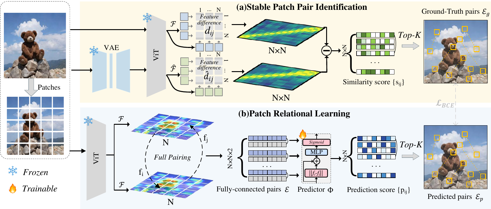

# Rel-Zero

Official code scaffold for **Rel-Zero: Harnessing Patch-Pair Invariance for
Robust Zero-Watermarking Against AI Editing**.

Rel-Zero is a zero-watermarking method: it does **not** modify image pixels.
Instead, it predicts a set of stable patch-pair relations from the original
image and verifies whether the same relational watermark survives editing or
common distortions.



## Highlights

- No image embedding or pixel perturbation is required.
- The watermark is represented as top-k stable patch-pair indices.
- Inference needs only the original/suspect image and a trained pair predictor.
- The release includes example edited image pairs and robustness scripts.

## Repository Layout

```text
Rel-Zero/
  assets/                 # framework figure used in the paper
  configs/                # example pair manifest and default settings
  examples/test_pairs/    # bundled test images
  src/relzero/            # model, metrics, data, noise and visualization code
  tools/                  # command-line evaluation scripts
  checkpoints/            # put downloaded checkpoints here
  outputs/                # generated visualizations/results
```

The bundled example pairs intentionally exclude `instruct_pix2pix_14_249632`.

## Installation

```bash
conda create -n relzero python=3.10 -y
conda activate relzero

pip install -e .
pip install -r requirements.txt
```

Install a CUDA-matched PyTorch build if your environment needs a specific CUDA
version.

## Checkpoint

Place a trained checkpoint under:

```text
checkpoints/relzero_stage1.pth
```

or pass its path explicitly with `--checkpoint`.

The expected checkpoint format is:

```python
{
    "model_state_dict": pipeline.state_dict(),
    "epoch": epoch,
}
```

## Train

The release includes a VAE-label training entry point. It builds stable
patch-pair targets from original images and their VAE reconstructions, then
trains the original-image-only Rel-Zero predictor.

```bash
python tools/train_relzero.py \
  --coco-root path/to/coco/train2014 \
  --coco-ann path/to/coco/annotations/captions_train2014.json \
  --checkpoint-dir checkpoints \
  --run-name relzero_train \
  --device cuda:0 \
  --train-size 2000 \
  --val-size 256 \
  --epochs 8
```

The best checkpoint is written to:

```text
checkpoints/relzero_train/best_stage1.pth
```

## Evaluate Edited Pairs

```bash
python tools/evaluate_pairs.py \
  --checkpoint checkpoints/relzero_stage1.pth \
  --pairs configs/example_pairs.json \
  --device cuda:0 \
  --negative-match-prob 0.06 \
  --target-fpr 0.001 \
  --output-json outputs/example_pairs.json
```

Optional edge visualizations:

```bash
python tools/evaluate_pairs.py \
  --checkpoint checkpoints/relzero_stage1.pth \
  --pairs configs/example_pairs.json \
  --save-vis
```

## Evaluate JPEG and Gaussian Noise

```bash
python tools/evaluate_noise.py \
  --checkpoint checkpoints/relzero_stage1.pth \
  --pairs configs/example_pairs.json \
  --device cuda:0 \
  --jpeg-quality 50 \
  --gaussian-sigma 0.05 \
  --negative-match-prob 0.06 \
  --target-fpr 0.001 \
  --output-json outputs/noise.json
```


## Metric

For each image pair, Rel-Zero predicts two top-k patch-pair sets. We report:

```text
precision = shared predicted pairs / top_k
```

For TPR@0.1%FPR, the release follows the binomial test used in the paper. With
`top_k=50`, `negative_match_prob=0.06`, and `target_fpr=0.001`, the detection
threshold is computed from the null distribution. Each observed matching
probability is then converted into:

```text
P[Binomial(top_k, observed_precision) >= threshold_matches]
```

## Custom Data

Create a manifest with the same format as `configs/example_pairs.json`:

```json
{
  "pairs": [
    {
      "name": "my_edit",
      "original": "path/to/original.png",
      "edited": "path/to/edited.png"
    }
  ]
}
```

Relative paths are resolved from the manifest file location.

## Citation

```bibtex
@inproceedings{chen2026rel,
  title={Rel-Zero: Harnessing Patch-Pair Invariance for Robust Zero-Watermarking Against AI Editing},
  author={Chen, Pengzhen and Liu, Yanwei and Gu, Xiaoyan and Chen, Xiaojun and Liu, Wu and Wang, Weiping},
  booktitle={Proceedings of the IEEE/CVF Conference on Computer Vision and Pattern Recognition},
  pages={3337--3346},
  year={2026}
}
```

## License

This code scaffold is released under the MIT License. Checkpoint weights and
third-party datasets may have separate licenses.
